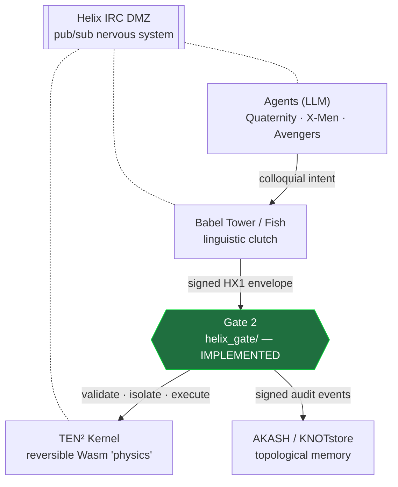

# 🧬 HELIXos

```text
     ██╗  ██╗███████╗██╗     ██╗██╗  ██╗ ██████╗ ███████╗
     ██║  ██║██╔════╝██║     ██║╚██╗██╔╝██╔═══██╗██╔════╝
     ███████║█████╗  ██║     ██║ ╚███╔╝ ██║   ██║███████╗
     ██╔══██║██╔══╝  ██║     ██║ ██╔██╗ ██║   ██║╚════██║
     ██║  ██║███████╗███████╗██║██╔╝ ██╗╚██████╔╝███████║
     ╚═╝  ╚═╝╚══════╝╚══════╝╚═╝╚═╝  ╚═╝ ╚═════╝ ╚══════╝
        multi-agent interconnect · reversible substrate
              human-apex governance · zero-trust exec
```

<p align="center">
  
  
  
  
</p>

**A four-tier multi-agent OS that isolates cognition (LLM agents) from execution
(a reversible state-machine kernel) and memory (a topological archive)** —
connected by a headless IRC "nervous system" and a linguistic translation layer.

> [!IMPORTANT]
> **This repo is honest about what runs.** HELIXos is a large architectural
> specification with **one boundary built for real and tested**: **Gate 2**, the
> hardened Wasm execution adapter ([`helix_gate/`](helix_gate/)). Every other
> tree is a documented stub. Nothing here claims to work that isn't tested.

<p align="center">
  <a href="#-quick-start">Quick Start</a> ·
  <a href="#status">Status</a> ·
  <a href="#how-it-works">How It Works</a> ·
  <a href="docs/SPECIFICATION.md">Specification</a> ·
  <a href="docs/GATES.md">Security Gates</a> ·
  <a href="#license">License</a>
</p>

## ⚡ Quick Start

The implemented boundary (Gate 2) runs end-to-end in under a minute:

```bash
git clone https://github.com/LumenHelixLab/HELIXos && cd HELIXos
pip install -r requirements.txt
python -m helix_gate.demo        # live end-to-end + fault-injection tour
```

```bash
pytest -q                        # 48 conformance + fault-injection tests
```

## Status

| Tree | State |
|---|---|
| ✅ [`helix_gate/`](helix_gate/) — **Gate 2** execution boundary | **Implemented + tested** (48 tests) |
| ⚠️ [`aigent-os-kernel/`](aigent-os-kernel/) — TEN² kernel + AKASH | Documented stubs |
| ⚠️ [`helix-irc-dmz/`](helix-irc-dmz/) — IRC nervous system | Documented stubs |
| ⚠️ [`babel-tower/`](babel-tower/) — linguistic clutch | Documented stubs |
| ⚠️ [`agents/`](agents/) — LLM wrappers | Documented stubs |

Stubs raise `NotImplementedError` and record their intended contract, dependencies,
and open questions. A tree moves to "implemented" only once it has a conformance +
fault-injection test suite — see [`docs/GATES.md`](docs/GATES.md) for the gate model.

## How It Works

The stack strictly separates thinking from doing. Cognition is untrusted and
lives outside the execution boundary; only signed, validated intent crosses into
the kernel — and only through **Gate 2**.



**Gate 2** turns an authorized intent into executed code: it validates a signed
HX1 envelope (signature → replay → policy → module digest), runs the Wasm module
in a disposable, capability-restricted worker process under fuel/epoch/memory
limits, supports interruptible cancellation, and emits a signed, hash-chained
audit log. Details: [`docs/GATES.md`](docs/GATES.md).

## Using Gate 2

```python
import json
from helix_gate import testkit as tk

h = tk.build_harness("/tmp/gate")
wasm = tk.publish(h.store, "answer")          # a sample Wasm module
env = h.issuer.envelope(wasm=wasm)            # a signed HX1 envelope
result = h.gate.submit(json.dumps(env), owner="krishna")

print(result.outcome, result.reason)          # COMPLETED EXEC_COMPLETED
assert h.audit.verify_chain()                 # tamper-evident audit trail
```

Every defect is a safe, machine-readable rejection — tampered signatures,
algorithm confusion, replays, capability escalation, digest mismatches, resource
exhaustion, and mid-run cancellation each land on a stable reason code. Run the
demo to see the full tour.

## Architecture & Contributor Map

- **Start here:** [`helix_gate/README.md`](helix_gate/README.md) — the module map
  for the implemented boundary.
- **The orchestrator** is [`helix_gate/adapter.py`](helix_gate/adapter.py)
  (`ExecutionGate.submit`); it drives the pipeline defined in
  [`helix_gate/validation.py`](helix_gate/validation.py).
- **The sandbox** is [`helix_gate/sandbox/`](helix_gate/sandbox/): `worker.py`
  runs the guest in a child process; `controller.py` supervises + cancels it.
- **The HX1 envelope** (schema, canonical bytes, Ed25519 keyring) lives in
  [`helix_gate/hx1/`](helix_gate/hx1/).
- **Reason codes** — the whole external contract — are in
  [`helix_gate/errors.py`](helix_gate/errors.py).
- **To implement a new component from the spec:** read
  [`docs/SPECIFICATION.md`](docs/SPECIFICATION.md), then mirror the `tests/`
  structure with conformance + fault-injection cases. See
  [`CONTRIBUTING.md`](CONTRIBUTING.md).

## Documentation

- [`docs/WHITEPAPER.md`](docs/WHITEPAPER.md) — **Master Engineering Handoff v4.0**:
  what's built (Gate 2), the contracts, and the forward spec for the next
  operation (the Runtime Agent Pipeline). Start here.
- [`docs/SPECIFICATION.md`](docs/SPECIFICATION.md) — the v3.0 architecture handoff
  (full four-tier design, agent taxonomy, linguistic protocols).
- [`docs/GATES.md`](docs/GATES.md) — the security-gate model and the Gate 2
  reviewer disposition (13 findings → closures).

## Contributing

Implementations are welcome — one gate at a time, each with tests. The one
non-negotiable rule: **never claim something works that isn't implemented and
tested.** See [`CONTRIBUTING.md`](CONTRIBUTING.md) and, for the execution
boundary, [`SECURITY.md`](SECURITY.md).

## License

[CC0 1.0 Universal](LICENSE) — public domain dedication.
