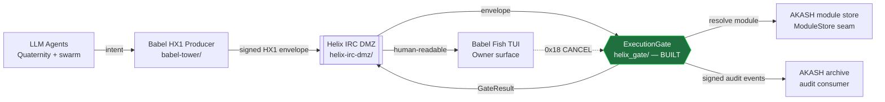

# 🧬 HELIXos — Master Engineering Handoff v4.0

**Multi-Agent Interconnect & Predictive Active Inference Substrate**
**Status:** One trust boundary locked (Gate 2). Next operation specified (Runtime Agent Pipeline).
**Audience:** The next multi-agent operation — a human engineering team or an
agent-driven build loop — that will implement §4.

> **How to read this document.** Everything in **§1–§3** is *implemented and
> tested* — it describes code that exists in this repository and passes CI.
> Everything in **§4** is a *forward specification* — a technical handoff for the
> next build. The two are visibly separated on purpose: HELIXos wraps ambitious
> framing around a small amount of genuinely working code, and the line between
> "built" and "designed" is never allowed to blur. No number appears in this
> paper without a reproduction command.

---

## §0 — Executive Summary

HELIXos is a four-tier system that isolates **cognition** (LLM agents) from
**execution** (a reversible state-machine kernel) and **memory** (a topological
archive), connected by a headless IRC "nervous system" and a linguistic
translation layer. The governing principle is *human-apex, zero-trust*: cognition
is untrusted and lives outside the execution boundary; only signed, validated
intent crosses into the kernel.

**What changed since v3.0.** The v3.0 handoff was entirely specification. This
release makes one boundary real:

| Layer / boundary | v3.0 | v4.0 |
|---|---|---|
| **Gate 2 — execution boundary** (`helix_gate/`) | prose | **implemented + tested** |
| 187 professional infrastructure (CI, community, AI-context) | — | added |
| `.claude/` contributor multi-agent operation | — | added |
| Kernel math, IRC DMZ, Babel, runtime agents | prose | still prose (honest stubs) |

**Disposition.** Gate 2 satisfies the exit criteria of an external security
review (13 findings, all closed — §1.4). The repository is now a working
codebase with a proven execution boundary and a clear, machine-actionable spec
for the next operation: the **Runtime Agent Pipeline** (§4) that produces the
signed intents Gate 2 already knows how to execute.

---

## §1 — Implemented Reality: Gate 2

> **This section describes code that exists and runs.** Reproduce with
> `pip install -r requirements.txt && pytest -q && python -m helix_gate.demo`.

**Gate 2** is the trust boundary that turns an *authorized intent* into
*executed code*. It ingests a signed **HX1 envelope**, fully validates it,
resolves and digest-verifies a Wasm module, executes that module in a disposable,
capability-restricted worker process under resource limits, drives a
deterministic lifecycle, and emits a signed, hash-chained audit log.

Scale (reproducible): `helix_gate/` is ~2,180 lines of Python across 20 modules,
with **48 conformance + fault-injection tests** (`pytest -q`) and a runnable
end-to-end demo (`python -m helix_gate.demo`).

### §1.1 The validation pipeline

`helix_gate/validation.py` runs one ordered sequence; each stage fails to a
stable, machine-readable reason code (§5.2):

```
decode → schema-validate → canonicalize → verify signature (Ed25519)
  → issuer/audience → time window → replay (nonce + monotonic sequence)
  → policy revision + capability manifest → resolve module + verify sha256
  → authorize → execute → signed audit event
```

Canonicalization (RFC 8785 profile, `hx1/canonical.py`) happens *inside*
signature verification, so the signature binds canonical bytes — logically
identical envelopes cannot present multiple serializations. The replay commit is
the last step before authorization and is attributable (the issuer is
cryptographically authenticated by then).

### §1.2 The sandbox

`helix_gate/sandbox/worker.py` runs the guest in a **spawned child process** with
**no host authority beyond the imports the adapter supplies** — which by default
is none. Enforced ceilings, all from the signed manifest's `resource_limits`:
Wasmtime **fuel** budget, **epoch/wall-clock** deadline (a watchdog thread bumps
the epoch), **memory**/**table**/**stack** limits, and an **output-byte** cap.

`sandbox/controller.py` supervises the child from the parent process, so the
parent stays responsive: cancellation is *concurrent* — a cooperative epoch
interrupt, then hard process termination if the guest does not stop. This is the
structural fix for the reviewer's finding that synchronous execution made
cancellation impossible.

### §1.3 Lifecycle, registry, audit

- **`lifecycle.py`** — an explicit finite-state machine (§5.3). Execution-terminal
  state and resource-cleanup state are tracked on **separate** dimensions; records
  are **retained**, never deleted, so a terminal outcome is always distinguishable
  from "unknown."
- **`registry.py`** — a durable SQLite registry with **atomic compare-and-set**
  transitions, distinct `operation_id` vs `sandbox_id`, restart recovery (orphans
  swept to `FAILED_UNSAFE`), and **idempotent cancellation** (re-cancelling a
  terminal op returns its outcome, never `TOO_LATE`).
- **`audit.py`** — signed (Ed25519), hash-chained (`previous_event_digest`),
  append-only structured events; `verify_chain()` detects tampering, reordering,
  or dropped events.

Diagnostic detail never reaches callers: results carry only a stable
`ReasonCode`; `detail` strings go to the audit channel only (`errors.py`,
`results.py`).

### §1.4 Reviewer findings → closures

Gate 2 was built against an external review that approved a "Draft 1" sketch's
direction but rejected its implementation (stubbed `return True` signature check,
no real isolation, uncancellable execution, an in-memory dict registry,
plain-string audit). All 13 findings are closed and each has a covering test;
the full table lives in [`GATES.md`](GATES.md) and the checklist is enforced by
`tests/test_traceability.py`.

### §1.5 Verification evidence

| Claim | Reproduction |
|---|---|
| 48 tests pass | `pytest -q` |
| End-to-end + fault-injection tour | `python -m helix_gate.demo` |
| Every reviewer finding is covered | `pytest tests/test_traceability.py` |
| Audit chain is tamper-evident | `pytest tests/test_audit.py` |

---

## §2 — The Contributor Multi-Agent Operation

HELIXos already runs one small multi-agent operation — not at runtime, but in
*development*. `.claude/` ([`.claude/README.md`](../.claude/README.md)) is a
Claude Code toolkit adapted from
[operator-kit](https://github.com/wrg32786/operator-kit) (MIT) and renamed to the
HELIXos deity tier. Five specialist arbiters, each echoing a Quaternity
orchestrator:

| Agent | Role | Quaternity echo |
|---|---|---|
| **ARGUS** | read-only codebase scout (`path:line`, no writes) | Charlotte (weaver) |
| **OGUN** | bounded builder — code + honesty ledger | Krishna (manifestor) |
| **THOTH** | cited research synthesis | Kali (synthesis) |
| **ATHENA** | read-only critique of a plan's risks | Natasha (red team) |
| **PTAH** | design/spec artifacts, not code | Charlotte (structure) |

A `UserPromptSubmit` context-loader hook injects relevant repo files when a
prompt mentions a HELIXos keyword. This operation is the *template* for §4: the
runtime pipeline reuses the same discipline (honesty ledgers, deny-by-default,
tests-with-code) at machine speed.

---

## §3 — The Gate Model (Security Roadmap)

HELIXos hardens its trust boundaries in ordered **gates**. A gate is not "locked"
until its boundary is implemented and passes conformance + fault-injection tests.

| Gate | Boundary | Status |
|---|---|---|
| Gate 1 | HX1 envelope format + issuer signing model | Design (verify side implemented in Gate 2) |
| **Gate 2** | **Execution boundary — the hardened Wasm adapter** | **Locked ✅** |
| Gate 3 | AKASH archive write/verify boundary (Akosh braid signatures) | Not started |

Gates are completed in order. The next operation (§4) does **not** open a new
gate; it builds the **producer side** that feeds the Gate 2 boundary and closes
Gate 1's issuing model — a prerequisite before Gate 3.

---

## §4 — NEXT OPERATION UPDATE: The Runtime Agent Pipeline

> **This section is a forward specification, not implemented code.** It is a
> technical handoff written so the next operation can execute it the way Gate 2
> was executed: explicit contracts, file targets, and acceptance gates.

### §4.1 Goal

Gate 2 can execute a signed intent, but today the *only* thing that produces one
is `helix_gate/testkit.py` — test fixtures with fixture keys. The Runtime Agent
Pipeline builds the **real producer side**: multiple LLM agents collaborate over
the Helix IRC DMZ; the Babel layer compiles an authorized intent plus a resolved
module into a **signed HX1 envelope**; that envelope flows into the existing
`ExecutionGate`; results are archived (AKASH) and surfaced (Babel Fish).

**The cardinal invariant:** *no agent utterance causes execution unless it was
compiled into a validly-signed HX1 envelope and accepted by Gate 2.* Cognition
stays untrusted; the boundary stays the only door.

### §4.2 Data flow



Green = already built. Everything else is this operation's scope.

### §4.3 Component specifications

Each component lists its responsibility, the files it creates, and its **seam**
with the built Gate 2 code. **Reuse the contracts in §5; do not modify
`helix_gate/`** except to swap the `ModuleStore` backend.

**1. Babel HX1 Producer** — `babel-tower/babel_dispatcher.py`, `babel_producer.py`
- Compiles `(intent, resolved_module, capability_request)` into a complete HX1
  envelope and **signs it** — the real counterpart to `testkit.Issuer.envelope` +
  `hx1.signature.sign_envelope`.
- Owns issuer identity: allocates `nonce` + monotonic `sequence` per issuer,
  authors a `capability_manifest` *within* the active policy, and sets the time
  window. Signing keys live behind a **KMS/HSM seam** (deferred in Gate 2).
- Seam: emits bytes accepted by `ExecutionGate.submit` (§5.4). Must never widen
  the `operation` beyond `EXECUTE_WASM_COMPONENT`; broad verbs (`REFACTOR`, …) are
  decomposed here, before the boundary.

**2. Helix IRC DMZ transport** — `helix-irc-dmz/daemon.py`, `helix_hub.py`
- Pub/sub broker with `#T-*` (persistent Thought) and `#t-*` (ephemeral thinking)
  channel classes; prediction-error-driven mode granting (`+o`/`+v`).
- Carries HX1 envelopes and Triangulated-Bus `[Ptr|Verb|Hash]` frames; maps the
  `0x18` CANCEL byte to `ExecutionGate.cancel(operation_id)` (§5.4).
- Seam: transport only — it moves envelopes and results; it never validates or
  executes. Validation is Gate 2's monopoly.

**3. Agent orchestration** — `agents/*.py` (LangGraph / LiteLLM)
- Wraps the Quaternity (Natasha/Charlotte/Krishna/Kali) and swarm tiers as LLM
  agents that negotiate intent over the DMZ. **Krishna** is the human-apex
  authorized-intent path (`!POSSESS`).
- Seam: agents produce *intent*, never envelopes directly — they hand intent to
  the Babel Producer, which is the only component holding signing authority.

**4. AKASH module store + audit sink** — implements `module_resolver.ModuleStore`
- Replaces `LocalModuleStore` with the `knot://` content-addressed backend
  (`aigent-os-kernel/knot_api_wrapper.py`). Fetch-by-digest only; Gate 2 already
  verifies sha256, so the store is untrusted transport.
- Consumes the signed audit event stream into the AKASH archive; `verify_chain()`
  gates archival.

### §4.4 Integration contracts (reuse, do not reinvent)

| Need | Reuse | File |
|---|---|---|
| Envelope shape | HX1 v1 schema (§5.1) | `helix_gate/hx1/schema.py` |
| Sign an envelope | `sign_envelope(signed_content, key, key_id)` | `helix_gate/hx1/signature.py` |
| Submit for execution | `ExecutionGate.submit(raw, owner, on_operation_id=)` | `helix_gate/adapter.py` |
| Cancel a run | `ExecutionGate.cancel(operation_id)` | `helix_gate/adapter.py` |
| Result contract | `GateResult` (§5.5) | `helix_gate/results.py` |
| Reason codes | `ReasonCode` (§5.2) | `helix_gate/errors.py` |
| Module fetch | `ModuleStore` protocol | `helix_gate/module_resolver.py` |

### §4.5 Acceptance gates (the operation's exit criteria)

The operation is **not done** until:

1. **End-to-end integration test**: an agent utterance → Babel-signed envelope →
   DMZ → `ExecutionGate.submit` → executed Wasm → `verify_chain()` passes. Lives
   in a new `tests/integration/`.
2. **Producer/consumer symmetry**: every envelope the Babel Producer emits is
   accepted by Gate 2 for the happy path, and **each Gate 2 reason code has a
   producer-side fault-injection test** proving the pipeline surfaces it (mirror
   `tests/` structure — conformance **and** fault injection).
3. **Cancellation path**: a `0x18` CANCEL over the DMZ terminates a running op
   with `CANCELLED` and is idempotent.
4. **No-bypass proof**: a test asserting that an intent which never passed the
   Babel signer cannot reach execution.
5. **Honesty**: components not yet implemented remain `NotImplementedError`
   stubs; docs move from "specified" to "implemented" only with tests.

### §4.6 Milestones (buildable units)

| # | Unit | Acceptance |
|---|---|---|
| M1 | Babel Producer + KMS/HSM signing seam | round-trips: `submit(producer.build(intent))` → `COMPLETED` |
| M2 | AKASH `ModuleStore` backend + audit sink | Gate 2 resolves real `knot://` modules; audit archived only if `verify_chain()` |
| M3 | IRC DMZ transport (envelopes + results + `0x18`) | envelope in → `GateResult` out over the bus; CANCEL works |
| M4 | Agent orchestration (Quaternity over DMZ) | two agents negotiate an intent that executes end-to-end |
| M5 | Babel Fish surface | Owner sees human-readable telemetry + can issue `!POSSESS` |

### §4.7 Deferred seams, risks, and open questions

- **Key custody is the crux.** M1's signing authority is the new trust root.
  Until a real KMS/HSM is wired, the pipeline is only as strong as its key store;
  ship it behind an interface and never with fixture keys in production.
- **Do not pretend to have the kernel.** The TEN² math (`fsm_core.py`) is
  unverified pending the source paper. The pipeline executes *Wasm modules*; it
  must not claim reversible-kernel semantics it does not have.
- **DMZ is untrusted transport.** Anything the IRC layer carries is attacker-
  reachable; Gate 2's validation is the guarantee, not the bus.
- **Open:** issuer-key rotation policy; multi-issuer trust (the keyring supports
  it — the producer/policy side must define it); back-pressure when the DMZ
  outpaces the sandbox pool.

---

## §5 — Contracts Appendix (verbatim from source)

### §5.1 HX1 v1 envelope

Fields the validator enforces (`helix_gate/hx1/schema.py`; signed content =
everything except `signature`):

```
schema_version="HX1/1.0", issuer, audience, issued_at, not_before, expires_at,
nonce, sequence, policy_revision, operation="EXECUTE_WASM_COMPONENT", target,
module{ artifact_ref="knot://<sha256>", sha256, runtime_profile, entrypoint,
        interface_version="helix:execution@1.0.0" },
capability_manifest{ imports[], input_objects[], output_destinations[],
    resource_limits{ fuel, wall_ms, memory_bytes, table_elems,
                     stack_bytes, output_bytes, host_calls } },
signature{ alg="ed25519", key_id, bytes }   # over canonical bytes of signed content
```

### §5.2 ReasonCode taxonomy (`helix_gate/errors.py`)

```
OK
# decode / schema
REJECTED_MALFORMED · REJECTED_SCHEMA_INVALID · REJECTED_SCHEMA_VERSION_UNSUPPORTED
# signature / key
REJECTED_ALG_UNSUPPORTED · REJECTED_KEY_UNKNOWN · REJECTED_KEY_REVOKED · REJECTED_SIGNATURE_INVALID
# issuer / audience / time
REJECTED_ISSUER_UNTRUSTED · REJECTED_AUDIENCE_MISMATCH
REJECTED_EXPIRED · REJECTED_NOT_YET_VALID · REJECTED_TIME_WINDOW_INVALID
# replay / policy / capability
REJECTED_REPLAY · REJECTED_SEQUENCE_REGRESSION · REJECTED_POLICY_REVISION
REJECTED_OPERATION_NOT_ALLOWED · REJECTED_CAPABILITY_ESCALATION · REJECTED_RESOURCE_LIMIT_EXCEEDS_POLICY
# module resolution
REJECTED_MODULE_NOT_FOUND · REJECTED_MODULE_DIGEST_MISMATCH · REJECTED_MODULE_INTERFACE_MISMATCH
# execution terminal
EXEC_COMPLETED · EXEC_CANCELLED · EXEC_TIMED_OUT · EXEC_TRAPPED · EXEC_OUTPUT_OVERFLOW
# unsafe
FAILED_UNSAFE
```

Outcomes (`GateOutcome`): `COMPLETED · REJECTED · CANCELLED · TIMED_OUT · TRAPPED · FAILED_UNSAFE`.

### §5.3 Lifecycle FSM (`helix_gate/lifecycle.py`)

```
RECEIVED → VALIDATING → REJECTED
RECEIVED → VALIDATING → AUTHORIZED → QUEUED → INITIALIZING → RUNNING → COMPLETED
RUNNING → CANCELLING → CANCELLED
RUNNING → TIMED_OUT | TRAPPED | FAILED_UNSAFE
INITIALIZING → CANCELLING | FAILED_UNSAFE
```
Cleanup dimension (separate): `ACTIVE → FROZEN → CLEANED_UP`. Abnormal terminals
(`TIMED_OUT`/`TRAPPED`/`FAILED_UNSAFE`) freeze resources before reclamation.

### §5.4 ExecutionGate API (`helix_gate/adapter.py`)

```python
ExecutionGate.submit(raw_envelope, owner="unknown", on_operation_id=None) -> GateResult
ExecutionGate.cancel(operation_id: str) -> dict   # {'actionable': bool, 'state': str|None}
```
`on_operation_id(op_id)` fires the instant the operation exists, so a caller can
`cancel()` from another thread while `submit()` is still running.

### §5.5 GateResult (`helix_gate/results.py`)

```
outcome: GateOutcome · reason: ReasonCode · operation_id · sandbox_id
terminal_state · cleanup_state · result_digest · output(bytes|None) · audit_seq
```

### §5.6 ModuleStore seam (`helix_gate/module_resolver.py`)

```python
class ModuleStore(Protocol):
    def fetch(self, digest: str) -> bytes | None: ...
```
The AKASH/`knot_api_wrapper` binding implements this. Gate 2 verifies the sha256,
so the store is untrusted.

---

## §6 — Verification & Reproduction

**Gate 2 (built):**
```bash
pip install -r requirements.txt
pytest -q                    # 48 conformance + fault-injection tests
python -m helix_gate.demo    # end-to-end + fault-injection tour
```

**Runtime Agent Pipeline (§4, to build):** each milestone adds its own
conformance + fault-injection suite mirroring `tests/`, plus the end-to-end
integration test in §4.5(1). CI (`.github/workflows/ci.yml`) already runs the
Gate 2 suite + demo on every PR; extend the same workflow, do not fork it.

---

*Honesty statement.* §1–§3 describe implemented, tested code. §4 is
specification. No benchmark, latency, or throughput figure appears in this
document; the only quantities cited (48 tests, ~2,180 LoC, 13 findings) have the
reproduction commands beside them. This is the same discipline the codebase
enforces on itself — see [`CONTRIBUTING.md`](../CONTRIBUTING.md).
